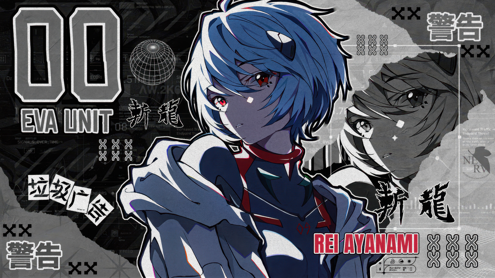

  
  
   
  
   
  
  

  

  
    

    

  
   
  
  
    
  
  

    
    
    
  

  

    
  <a href="https://github.com/gachiakuuta">
  <picture>
  <source media="(prefers-color-scheme: dark)" srcset="https://raw.githubusercontent.com/gachiakuuta/gachiakuuta/refs/heads/output/github-contribution-grid-snake-dark.svg">
  <source media="(prefers-color-scheme: light)" srcset="https://raw.githubusercontent.com/gachiakuuta/gachiakuuta/refs/heads/output/github-contribution-grid-snake.svg">
  
</picture>

